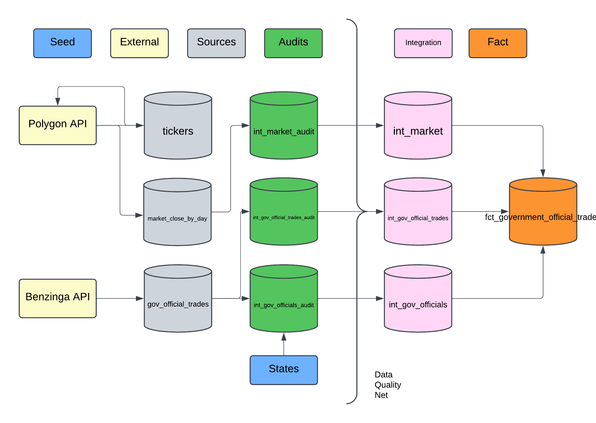

# Government Officials Stock Trades
This project combines stock information with government official's trading records (Senate & House of Representatives). Daily batch processing brings in data from the Polygon and Benzinga APIs to showcase trading information. Explore how your state representatives are trading and what committees they are on that may influence their decisions...

## Technologies Used
 
 
 
 
 
 
 
 

## Dashboard

## Data Model


## Table of Contents
1. [Technology Choices](#Technology-Choices)
2. [Initial Data Investigations - Polygon API](#Initial-Data-Investigations---Polygon-API)
    1. [Tickers API EndPoint](#Tickers-API-EndPoint)
    3. [Market Open/Close API Endpoint](#Market-Open/Close-API-Endpoint)
3. [Initial Data Investigations - Benzinga API](#Initial-Data-Investigations---Benzinga-API)
    1. [Government Trades API Endpoint](#Government-Trades-API-Endpoint)
3. [Integration Layer](#Integration-Layer)
    1. [AWS S3 Bucket](#AWS-S3-Bucket)
    2. [Snowflake INTEGRATION](#Snowflake-INTEGRATION)
    1. [Snowflake STAGE & COPY INTO](#Snowflake-STAGE-&-COPY-INTO)
    4. [Tickers Integration](#Tickers-Integration)
4. [DBT Write-Audit-Publish Pattern](#DBT-Write-Audit-Publish-Pattern)
5. [DBT Tags](#DBT-Tags)
6. [Airflow Orchestration](#Airflow-Orchestration)

## Technology Choices
From a skillset perspective I am proficient in SQL and Python, which led me to choose these tools:
 - **Airflow**: dependable and mature orchestration tool to handle dependencies
 - **Docker**: used to easily spin up Astronomer/Airflow environment and great environment reproducibility
 - **AWS**: most mature cloud provider and easy to integrate with using the Python AWS SDK
 - **Snowflake**: easy integration due to SnowPark and Snowflake's COPY INTO command made it super easy to move data from S3 buckets into the warehouse. All Snowflake queries can be found in `include/snowflake`
 - **DBT**: popular SQL abstraction tool that allowed me to easily document the SQL models, write tests, and handle data lineage 
 - **Looker**: I shopped around for presentation tools, but Looker's free tier actually allowed me to publicly share a dashboard so I was sold

## Initial Data Investigations - Polygon API
Taking a look at the Polygon API JSON results that were available. It is always important to look at the data you'll be working with before you start!

### Tickers API EndPoint
URL: https://api.polygon.io/v3/reference/tickers?active=true&limit=1&apiKey=...  
**Results**
```json
{
  "count": 1,
  "next_url": "https://api.polygon.io/v3/reference/tickers?cursor=YWN0aXZlPXRydWUmZGF0ZT0yMDIxLTA0LTI1JmxpbWl0PTEmb3JkZXI9YXNjJnBhZ2VfbWFya2VyPUElN0M5YWRjMjY0ZTgyM2E1ZjBiOGUyNDc5YmZiOGE1YmYwNDVkYzU0YjgwMDcyMWE2YmI1ZjBjMjQwMjU4MjFmNGZiJnNvcnQ9dGlja2Vy",
  "request_id": "e70013d92930de90e089dc8fa098888e",
  "results": [
    {
      "active": true,
      "cik": "0001090872",
      "composite_figi": "BBG000BWQYZ5",
      "currency_name": "usd",
      "last_updated_utc": "2021-04-25T00:00:00Z",
      "locale": "us",
      "market": "stocks",
      "name": "Agilent Technologies Inc.",
      "primary_exchange": "XNYS",
      "share_class_figi": "BBG001SCTQY4",
      "ticker": "A",
      "type": "CS"
    }
  ],
  "status": "OK"
}
```
<sup>Initial thoughts: only need the results JSON. An active field shows that this is time-variant (A ticker could be inactive at some point). We have a last updated UTC timestamp that we can utilize as a watermark if needed. Main data point is "ticker," but there are types we need to take into account as well. Ex. Crypto, Stocks, Indexes</sup>

### Market Open/Close API Endpoint
URL: https://api.polygon.io/v1/open-close/{ticker}/{date}?adjusted=true&apiKey=... 

**Results**
```json
{
  "status": "OK",
  "from": "2023-01-09",
  "symbol": "AAPL",
  "open": 130.465,
  "high": 133.41,
  "low": 129.89,
  "close": 130.15,
  "volume": 70790813,
  "afterHours": 129.85,
  "preMarket": 129.6
}
```
<sup>Initial thoughts: pretty straightforward, not that familiar with stocks in general so afterHours and preMarket are a little mysterious. Noticed the status value that we can check. Also noticing the decimal values can have more than 2 decimal places.</sup>

## Initial Data Investigations - Benzinga API

### Government Trades API Endpoint
URL: https://www.benzinga.com/api/v1/gov/usa/congress/trades?pagesize=1&date={date}&token=...  

**Results**

```json
{
  "data": [
    {
      "amendment_number": 0,
      "amount": "$1,001 - $15,000",
      "chamber": "House",
      "description": "",
      "disclosure_url": "https://disclosures-clerk.house.gov/public_disc/ptr-pdfs/2024/20026376.pdf",
      "filer_info": {
        "chamber": "House",
        "committees": {
          "Committee on Education and the Workforce": [
            "Higher Education and Workforce Development"
          ],
          "Committee on Oversight and Accountability": [
            "Health Care and Financial Services",
            "National Security, the Border, and Foreign Affairs"
          ]
        },
        "display_name": "Virginia Foxx",
        "district": "5",
        "headshot": "https://clerk.house.gov/content/assets/img/members/F000450.jpg",
        "id": "63e7f7977f74dda3e85f46ba",
        "leadership_positions": [],
        "member_id": "F000450",
        "member_name": "Virginia Foxx",
        "party": "R",
        "state": "NC",
        "status": "Member",
        "updated": 1734012102,
        "website": "https://foxx.house.gov/"
      },
      "id": "675aecd10acf91e17b1e33c5",
      "notification_date": "2024-12-11",
      "ownership": "JT",
      "report_date": "2024-12-11",
      "report_id": "20026376",
      "security": {
        "name": "Alliance Res Partners",
        "ticker": "ARLP",
        "type": "STOCK"
      },
      "transaction_date": "2024-11-14",
      "transaction_id": "b7715f45d0fa77bfb92ef61cb51525652164f902",
      "transaction_type": "P",
      "updated": 1734012113
    }
  ]
}
```
<sup>Initial thoughts: this has multiple updated epoch timestamps. Broken down into the filer_info and the actual trade info. Looks like we are only given a bucket range of the amount in the trade. There are multiple dates that need to be understood on the transaction. Report Date is almost a month after the actual transaction date, so there is lag. Updated epoch is a godsend.</sup>


## Integration Layer
What is often overlooked in a data project is creating the integration layer that allows the building of pipelines and models off of. The integration layer happened in two stages: 

1. Pinging the APIs and storing the JSON in S3 Buckets
2. Using Snowflake's COPY INTO command to move the JSON files into tables
### AWS S3 Bucket
S3 Buckets were a way to easily store the API results in their raw form (mostly raw, I compressed them using gzip for lower cost). This allowed me to easily re-trigger integrations and test the snowflake side of things. I created two S3 buckets, one for each API, and had each S3 bucket delete any data older than 7 days to save on costs. If this was a production pipeline, I would have the data archived after a certain time frame.
### Snowflake INTEGRATION
Snowflake allows integration with AWS using an IAM role so credentials are not stored in a Snowflake STAGE anywhere. For more info on creating a Snowflake INTEGRATION with AWS, I would check out this walkthrough article: https://interworks.com/blog/2023/02/14/configuring-storage-integrations-between-snowflake-and-aws-s3/

### Snowflake STAGE & COPY INTO
Snowflake allows the use of STAGEs, external sources, which greatly simplified the use of COPY INTO. STAGEs allow easy integration as Snowflake even keeps track of what files have been loaded. STAGEs are unique to Snowflake and are marked by the @ symbol. It was easy to supply the COPY command a wildcard and let it go to work, regardless of how many files weren't synced. I just setup the STAGEs and wrote COPY INTO queries that parse the JSON columns into a table format. Example below:
```sql
COPY INTO STOCK_DB.source.market_close_by_day 
FROM (
    SELECT
        $1:status::STRING AS status,
        $1:from::DATE AS date_recorded,
        $1:symbol::STRING AS symbol,
        $1:open::DECIMAL(20,4) AS open,
        $1:high::DECIMAL(20,4) AS high,
        $1:low::DECIMAL(20,4) AS low,
        $1:close::DECIMAL(20,4) AS close,
        $1:volume::BIGINT AS stock_volume,
        $1:afterhours::DECIMAL(20,4) AS after_hours,
        $1:premarket::DECIMAL(20,4) AS pre_market
    FROM @STOCK_DB.external_stages.market_close --STAGE
    (FILE_FORMAT => 'STOCK_DB.file_formats.json_format')
)
PATTERN = '.*market_close.*'
ON_ERROR = 'SKIP_FILE_10%';
```
<sup>The ON_ERROR argument tells the process to skip any files that errored for more than 10% of the rows.</sup>

### Tickers Integration
The tickers integration is unique as I am grabbing the full list of tickers every time. The initial designs posed a problem. Snowpark only allows overwrite or append. So I could overwrite the table every run or truncate the table and then append records into it. Either way, if an error happened, it could leave the tickers table empty or missing data. I didn't want that to happen as the Market Open/Close API call uses the table to loop through every ticker and call the API. I needed to make sure that if the integration failed, the table would still have data from the last run.  

I decided on creating a staging table for the initial data and then having a stored procedure that would merge the data into the tickers table, making it an exact copy. This allowed any updates to occur as needed. There is still the possibility of no data being inserted and the merge then matches the staging, deleting all the records. It's unlikely to occur though since the API needs to be available (a sensor checks availability) for the tasks to trigger. My project demanded only so much bullet-proofing.

## DBT Write-Audit-Publish Pattern
I had a lot of fun trying to figure out how to efficiently audit the data. I treated it as a challenge of "what if these pipelines became very large". DBT is great to easily get started and just fire away queries at your engine, but it takes work to figure out how to use it at scale. I wrote a detailed article on how I set up a Write-Audit-Publish pattern in DBT that I used in this project. Link: https://medium.com/@cortlandgoffena/dbt-write-audit-publish-9b5fc6bbd73d


## DBT Tags
One of the challenges I faced in this project was how to have DBT step through the Write-Audit-Publish pattern easily. I found out how to do it step by step for one model, but then triggering each step of the pattern for all the models was challenging. I landed on adding tags to each model so that I could easily trigger the audit models (tagged as "audit"), then test them, and then trigger the incremental models. You'll notice my data model diagram at the beginning of the documentation is broken out into stages. These are easily triggered through DBT with tagging. Below is an example of how to trigger DBT models that are tagged:
```bash
dbt run -s tag:audit
```
Pros:
- Easy organization of models into stages
- Less complexity while still maintaining Write-Audit-Publish pattern 

Cons:
- If a model isn't tagged, it isn't ran in the pipeline
- Lose out on some optimization as each model in the dbt tagged stage needs to complete before the next one can trigger

## Airflow Orchestration
One of the challenges I ran into with this project was the orchestration of all the pipelines. If an integration pipeline with one of the APIs failed, I did not want DBT to run and add no data inside Snowflake. I ended up using the TriggerDagRunOperator and the ExternalTaskSensor within the dag `main.py`. This allowed me to trigger the dags in an appropriate order and use a sensor to ensure integrations succeeded before triggering DBT! 

There is more than one way to do this. I could also have setup my DBT run to have custom sensors on the data in the Snowflake tables. This is probably a better approach since it decouples and looks at data dependencies instead of task dependencies.