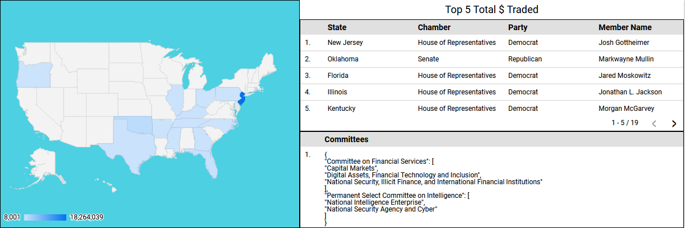
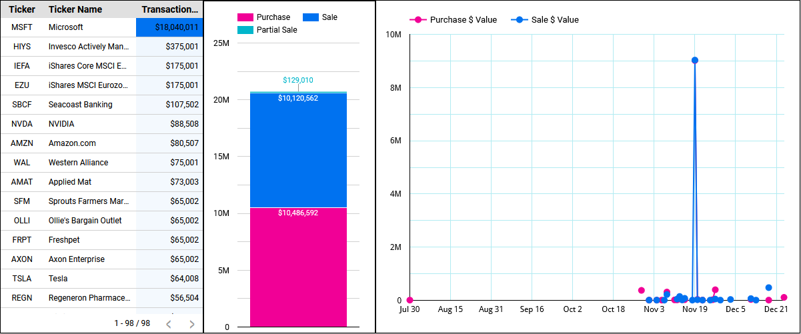

# Government Officials Stock Trades
This project combines stock information with government official's trading records (Senate & House of Representatives). Daily batch processing brings in data from the Polygon and Benzinga APIs to showcase trading information. Explore how your state representatives are trading, approximate amounts that are traded, and what committees they are on that may influence their decisions...

## Technologies Used
 
 
 
 
 
 
 
 

## Dashboard


<sup>Link: <a href=https://lookerstudio.google.com/reporting/8d054d46-3ad9-4a95-a42a-2456af1f8f2e>Government Officials Stock Trades</a> - reports 2024-12-01 forward ( If the graphs aren't loading, my snowflake instance may not have enough credits, come back later :P )</sup>


## Data Warehouse Overview


## Table of Contents
1. [Introduction](#Introduction)
1. [Technology Choices](#Technology-Choices)
2. [Initial Data Investigations - Polygon API](#Initial-Data-Investigations---Polygon-API)
    1. [Tickers API EndPoint](#Tickers-API-EndPoint)
    3. [Market Open/Close API Endpoint](#Market-Open/Close-API-Endpoint)
3. [Initial Data Investigations - Benzinga API](#Initial-Data-Investigations---Benzinga-API)
    1. [Government Trades API Endpoint](#Government-Trades-API-Endpoint)
4. [API Rate Limiting](#API-Rate-Limiting)
3. [Integration Layer](#Integration-Layer)
    1. [AWS S3 Bucket](#AWS-S3-Bucket)
    2. [Snowflake INTEGRATION](#Snowflake-INTEGRATION)
    1. [Snowflake STAGE & COPY INTO](#Snowflake-STAGE-&-COPY-INTO)
    4. [Tickers Integration](#Tickers-Integration)
4. [DBT Write-Audit-Publish Pattern](#DBT-Write-Audit-Publish-Pattern)
5. [DBT Tags](#DBT-Tags)
6. [Airflow Orchestration](#Airflow-Orchestration)
7. [Efficiencies](#Efficiencies)
8. [Snowflake Deletes](#Snowflake-Deletes)
9. [Deployment](#Deployment)
9. [Summary](#Summary)

## Introduction
This portfolio project is designed to showcase my ability to learn new technologies. I created this project during the month of December, 2024. Every technology chosen in this project I had limited knowledge in. Each section is commentary on the project that includes my learnings along the way. Enjoy!

## Technology Choices
From a skillset perspective I am proficient in SQL and Python, which led me to choose these tools:
 - **Airflow**: dependable and mature orchestration tool to handle dependencies. Other choice was Dagster due to its great integration with DBT.
 - **Docker**: used to easily spin up Astronomer/Airflow environment and great environment reproducibility.
 - **AWS**: most mature cloud provider and easy to integrate with using the Python AWS SDK. I had experience with Azure but wanted to expand my skillset.
 - **Snowflake**: easy integration due to SnowPark and Snowflake's COPY INTO command. Makes it super easy to move data from cloud storage into the warehouse. I had experience with DataBricks, but DBT and Snowflake seemed like a great hassle-free combo. All Snowflake queries can be found in `include/snowflake/`.
 - **DBT**: popular SQL abstraction tool that allowed me to easily keep SQL in source control, write tests, and handle data lineage. Other choice was SQLMesh, but DBT's popularity won out.
 - **Looker**: Looker's free tier allowed me to publicly share a dashboard. I checked out Tableau and Preset, but their sharing options were limited.

## Initial Data Investigations - Polygon API
Taking a look at the Polygon API JSON results that were available. Polygon turned out to be really great, with affordable subscriptions for their endpoints. It is always important to look at the data you'll be working with before you start!

### Tickers API EndPoint
URL: https://api.polygon.io/v3/reference/tickers?active=true&limit=1&apiKey=...  
**Results**
```json
{
  "count": 1,
  "next_url": "https://api.polygon.io/v3/reference/tickers?cursor=YWN0aXZlPXRydWUmZGF0ZT0yMDIxLTA0LTI1JmxpbWl0PTEmb3JkZXI9YXNjJnBhZ2VfbWFya2VyPUElN0M5YWRjMjY0ZTgyM2E1ZjBiOGUyNDc5YmZiOGE1YmYwNDVkYzU0YjgwMDcyMWE2YmI1ZjBjMjQwMjU4MjFmNGZiJnNvcnQ9dGlja2Vy",
  "request_id": "e70013d92930de90e089dc8fa098888e",
  "results": [
    {
      "active": true,
      "cik": "0001090872",
      "composite_figi": "BBG000BWQYZ5",
      "currency_name": "usd",
      "last_updated_utc": "2021-04-25T00:00:00Z",
      "locale": "us",
      "market": "stocks",
      "name": "Agilent Technologies Inc.",
      "primary_exchange": "XNYS",
      "share_class_figi": "BBG001SCTQY4",
      "ticker": "A",
      "type": "CS"
    }
  ],
  "status": "OK"
}
```
<sup>Initial thoughts: only need the results JSON. An active field shows that this is time-variant (A ticker could be inactive at some point). We have a last updated UTC timestamp that we can utilize as a watermark if needed. Main data point is "ticker," but there are types we need to take into account as well. Ex. Crypto, Stocks, Indexes</sup>

### Market Open/Close API Endpoint
URL: https://api.polygon.io/v1/open-close/{ticker}/{date}?adjusted=true&apiKey=... 

**Results**
```json
{
  "status": "OK",
  "from": "2023-01-09",
  "symbol": "AAPL",
  "open": 130.465,
  "high": 133.41,
  "low": 129.89,
  "close": 130.15,
  "volume": 70790813,
  "afterHours": 129.85,
  "preMarket": 129.6
}
```
<sup>Initial thoughts: pretty straightforward, not that familiar with stocks in general so afterHours and preMarket are a little mysterious. Noticed the status value that we can check. Also noticing the decimal values can have more than 2 decimal places.</sup>

## Initial Data Investigations - Benzinga API
Benzinga gave the most detailed information about government official trading. They had a 2 week trial showcasing the last month's worth of data. Their pricing for a plan ended up being atrocious though at $300 a month for just the government trades endpoint. They also hid their pricing behind "Contact Us". No thank you. So I grabbed a month's worth to showcase. Not worth getting a different endpoint after the investment in code. Maybe I'll switch later but other endpoints aren't as fleshed out. 

### Government Trades API Endpoint
URL: https://www.benzinga.com/api/v1/gov/usa/congress/trades?pagesize=1&date={date}&token=...  

**Results**

```json
{
  "data": [
    {
      "amendment_number": 0,
      "amount": "$1,001 - $15,000",
      "chamber": "House",
      "description": "",
      "disclosure_url": "https://disclosures-clerk.house.gov/public_disc/ptr-pdfs/2024/20026376.pdf",
      "filer_info": {
        "chamber": "House",
        "committees": {
          "Committee on Education and the Workforce": [
            "Higher Education and Workforce Development"
          ],
          "Committee on Oversight and Accountability": [
            "Health Care and Financial Services",
            "National Security, the Border, and Foreign Affairs"
          ]
        },
        "display_name": "Virginia Foxx",
        "district": "5",
        "headshot": "https://clerk.house.gov/content/assets/img/members/F000450.jpg",
        "id": "63e7f7977f74dda3e85f46ba",
        "leadership_positions": [],
        "member_id": "F000450",
        "member_name": "Virginia Foxx",
        "party": "R",
        "state": "NC",
        "status": "Member",
        "updated": 1734012102,
        "website": "https://foxx.house.gov/"
      },
      "id": "675aecd10acf91e17b1e33c5",
      "notification_date": "2024-12-11",
      "ownership": "JT",
      "report_date": "2024-12-11",
      "report_id": "20026376",
      "security": {
        "name": "Alliance Res Partners",
        "ticker": "ARLP",
        "type": "STOCK"
      },
      "transaction_date": "2024-11-14",
      "transaction_id": "b7715f45d0fa77bfb92ef61cb51525652164f902",
      "transaction_type": "P",
      "updated": 1734012113
    }
  ]
}
```
<sup>Initial thoughts: this has multiple updated epoch timestamps. Broken down into the filer_info and the actual trade info. Looks like we are only given a bucket range of the amount in the trade. There are multiple dates that need to be understood on the transaction. Report Date is almost a month after the actual transaction date, so there is lag. Updated epoch is a godsend.</sup>

## API Rate Limiting
The Polygon API offers a free tier of 5 calls per minute while the Benzinga offers an all out free trial. The Polygon API posed an interesting problem during testing as I needed to rate-limit the API. I ended up with the below code to ensure I respected their endpoint:
```python
def fetch_with_retries(url, max_retries=10, initial_delay=12):
    retries = 0
    while retries < max_retries:
        response = requests.get(url)
        # exceeded api call limit; 429 Too Many Requests
        if response.status_code == 429:
            # Retry with exponential backoff
            # Add jitter for API calls to be randomly staggered
            jittered_delay = random.uniform(initial_delay-1, initial_delay)
            expo = float(2 ** retries)
            wait_time = float(response.headers.get("Retry-After", jittered_delay * expo))
            print(f"Rate Limited: Retrying in {wait_time:.2f} seconds... Function Retries Left: {max_retries - retries}")
            time.sleep(wait_time)
            retries += 1
        elif response.status_code == 200:
            return response.json()
        else:
            response.raise_for_status() # Raise an exception for other error codes
    raise Exception("Exceeded maximum retries for the API request")
```

## Integration Layer
What is often overlooked in a data project is creating the integration layer to create and maintain an Operational Data Store (ODS). The ODS allows for the building of pipelines and models within the Data Warehouse. The integration layer happens in two stages: 

1. Pinging the APIs and storing the JSON in S3 Buckets
2. Using Snowflake's COPY INTO command to move the JSON files into tables
### AWS S3 Bucket
S3 Buckets were a way to easily store the API results in their raw form. This allowed me to easily re-trigger integrations and test the snowflake side of things. I created two S3 buckets, one for each API, and had each S3 bucket delete any data older than 7 days to save on costs. If this was a production pipeline, I would have the data archived after a certain time frame. I also compressed the files before storing them to lower storage costs (hey, its a personal  project, I can be frugal). Example below:
```python
try:
    # Create binary buffer to story in compressed bytes in memory   
    buffer = io.BytesIO()
    with gzip.GzipFile(fileobj=buffer, mode='w') as file:
        file.write(json_data.encode('utf-8'))

    # Reset buffer so it can be read from beginning for writing to s3
    buffer.seek(0)

    # Specify compression type
    s3.put_object(Body=buffer, Bucket=bucket_name, Key=key, ContentEncoding='gzip')
except botocore.exceptions.ClientError as error:
    print(f"Error uploading key: {key}; error: {error}")
```

### Snowflake INTEGRATION
Snowflake allows integration with AWS using an IAM role so credentials are not stored in a Snowflake STAGE anywhere. For more info on creating a Snowflake INTEGRATION with AWS, I would check out this walkthrough article: https://interworks.com/blog/2023/02/14/configuring-storage-integrations-between-snowflake-and-aws-s3/

### Snowflake STAGE & COPY INTO
Snowflake allows the use of STAGEs, external sources, which greatly simplified the use of COPY INTO. STAGEs allow easy integration as Snowflake even keeps track of what files have been loaded. STAGEs are unique to Snowflake and are marked by the @ symbol. It was easy to supply the COPY command a wildcard and let it go to work, regardless of how many files weren't synced. I just setup the STAGEs and wrote COPY INTO queries that parse the JSON columns into a table format. Example below:
```sql
COPY INTO STOCK_DB.source.market_close_by_day 
FROM (
    SELECT
        $1:status::STRING AS status,
        $1:from::DATE AS date_recorded,
        $1:symbol::STRING AS symbol,
        $1:open::DECIMAL(20,4) AS open,
        $1:high::DECIMAL(20,4) AS high,
        $1:low::DECIMAL(20,4) AS low,
        $1:close::DECIMAL(20,4) AS close,
        $1:volume::BIGINT AS stock_volume,
        $1:afterhours::DECIMAL(20,4) AS after_hours,
        $1:premarket::DECIMAL(20,4) AS pre_market
    FROM @STOCK_DB.external_stages.market_close --STAGE
    (FILE_FORMAT => 'STOCK_DB.file_formats.json_format')
)
PATTERN = '.*market_close.*'
ON_ERROR = 'SKIP_FILE_10%';
```
<sup>The ON_ERROR argument tells the process to skip any files that errored for more than 10% of the rows. I later removed this so I could be alerted of errors.</sup>

### Tickers Integration
The tickers integration is unique as I am grabbing the full list of tickers every time. The initial designs posed a problem. Snowpark only allows overwrite or append. So I could overwrite the table every run or truncate the table and then append records into it. **Either way, if an error happened, it could leave the tickers table empty or missing data.** I didn't want that to happen as the Market Open/Close API call uses the table to loop through every ticker and call the API. I needed to make sure that if the integration failed, the table would still have data from the last run.  

I decided on creating a staging table for the initial data and then having a stored procedure that would merge the data into the tickers table, making it an exact copy. This allowed any updates to occur as needed. There is still the possibility of no data being inserted and the merge then matches the staging, deleting all the records. It's unlikely to occur though since the API needs to be available (a sensor checks availability) for the tasks to trigger. My project demanded only so much bullet-proofing. I ended up changing some of the initial design mentioned here: [Efficiencies](#Efficiencies)

## DBT Write-Audit-Publish Pattern
I had a lot of fun trying to figure out how to efficiently audit the data. I treated it as a challenge of "what if these pipelines became very large". DBT is great to easily get started and just fire away queries at your engine, but it takes work to figure out how to use it at scale. 

My solution was to write the models to query a date that was supplied at run time. This allowed increments to happen and audits on the incremental data specifically so I wasn't auditing old data and wasting compute. I wrote a <a href=https://medium.com/@cortlandgoffena/dbt-write-audit-publish-9b5fc6bbd73d>detailed article</a> on how I set up a Write-Audit-Publish pattern in DBT that I used in this project.

There were quite a few times that data issues found their way into snowflake  due to my code. Having the bad data not make its way to the published models and being able to check the data in the audit tables was a life-saver.

## DBT Tags
One of the challenges I faced in this project was how to have DBT step through the Write-Audit-Publish pattern easily. I found out how to do it step by step for one model, but then triggering each step of the pattern for all the models was challenging. I landed on adding tags to each model so that I could easily trigger the audit models (tagged as "audit"), then test them, and then trigger the incremental models. You'll notice my [data warehouse diagram](#Data-Warehouse-Overview) at the beginning of the documentation is broken out into layers. These are easily triggered through DBT with tagging. Below is an example of how to trigger DBT models that are tagged:
```bash
dbt run -s tag:audit
```
Pros:
- Easy organization of models into layers
- Less complexity while still maintaining Write-Audit-Publish pattern 

Cons:
- If a model isn't tagged, it isn't ran in the DBT pipeline
- Lose out on some optimization as each model in the dbt tagged layer needs to complete before the next one can trigger

## Airflow Orchestration
One of the challenges I ran into with this project was the orchestration of all the pipelines. If an integration pipeline with one of the APIs failed, I did not want DBT to run and add no data inside Snowflake. I ended up using the TriggerDagRunOperator within the dag `main.py`. This allowed me to trigger the dags in an appropriate order and ensure integrations succeeded before triggering DBT! 

There is more than one way to do this. I could also have setup my DBT run to have custom sensors on the data in the Snowflake tables or used Datasets. This is probably a better approach since it decouples and looks at data dependencies instead of task dependencies.

Note: There was an error/bug that kept occurring during backfilling. A day of research didn't solve it. The dag's triggered by the TriggerDagRunOperator kept stalling in "queued" state. I ended up just writing a bash script `helpers/backfill_dag.sh` to simulate the backfill command. This actually became very useful to easily clear tasks that failed after I fixed them to re-trigger them since the pipeline is idempotent. If you clear a task in Airflow that was "backfilled", only a backfill can re-fill it. That can be really annoying sometimes so I ended up avoiding that!

## Efficiencies
Initial design pulled the closing stats for every ticker through the Polygon API. I utilized the Tickers table to create a for-loop for the API. Given my analysis was around government officials' trades, I modified the logic later to only grab the tickers from the government officials table that had been traded. If it wasn't a personal project, I probably would store information about all tickers. It could come in handy later. I also modified my pipeline to only run everything if government trade data was available. This made it small, concise, and efficient. See below.


## Snowflake Deletes
Snowflake does not allow for an easy way of de-duplicating data and I found this out the hard way. In SQL Server I would do something like this:
```sql
;WITH DELETE_CTE AS (
  SELECT
  ...,
  ROW_NUMBER() OVER (PARTITION BY ... ORDER BY ...) AS row_num
  FROM Table_A
)
DELETE FROM Table_A WHERE row_num > 1
```
Snowflake does not allow deletes through the use of CTE's, so the below is what I had to hack together to ensure de-duplication in one instance, and yes it is a lot more code:
```sql
CREATE OR REPLACE TRANSIENT TABLE duplicate_holder AS (
    SELECT
    ...
    FROM Table_A
    GROUP BY 1, 2, 3, 4, 5, 6, 7, 8, 9, 10 --Group by EVERY column
    HAVING COUNT(*) > 1
);

DELETE FROM Table_A AS a
USING duplicate_holder AS b
WHERE a.column_1 = b.column_1 --Join on EVERY column
  AND a.column_2 = b.column_2
  AND a.column_3 = b.column_3
  ...;

INSERT INTO Table_A
SELECT * FROM duplicate_holder;
```
Pretty crazy, right? New technology is great, but the flexibility normally means other things were given up. I have not found a better way to do it yet, so if you know please tell me!

## Deployment
With the project being a containerized airflow instance, I had a couple options for deployment in AWS:  
1. I could be old-fashioned and manually setup the docker containers on an EC2 instance. Turns out that the astro/airflow environment requires 2GB of memory, so that took it out of the Free Tier for me. Small version (1 CPU Core, 2GB memory) would be about $17 per month.
2. I could utilize Elastic Container Service (ECS) and setup an EC2 instance to be a part of the cluster. This is the middle ground as it allows me to better utilize Docker while also setting my compute through my selection of the EC2 instance. I tried this out but realized I would need 2GB of memory, so same boat except easy deployments of the containers through a docker image.
3. Utilize Elastic Container Service (ECS) with Fargate (serverless compute). This would allow me to only pay for resources I use. It sounds great since I only have a daily pipeline that averages 5 minutes, but setting up the docker volumes could be tricky since Fargate is designed for stateless services, similar to lambda function. Kept getting more complicated and more complicated. A sign that it probably wasn't a good option.
 
Option #1 actually ended up being the best option due to its simplicity. The Astro CLI does not play friendly with anything else than astronomer and I found that out the hard way. Using astronomer ended up having an issue with their deploy command and it would have ended up being $250 a month or so. Nope. Ended up deploying to an EC2 instance and I was able to use SSH tunneling to still look at the Airflow webserver without exposing my server to the public. Score.

Pros:
- Easy to set up volumes because docker handles it on the EC2 instance
- Can access the airflow server easily since it's always up  
  - Allows me to easily debug as well  

Cons:
- I'm charged per hour for server up-time, no way to save money
- Hard to scale up, migrating means I would have to move the volumes if I wanted to maintain history.  

## Summary
As you can see with the diversity of information and sections, not every data project is simple and easy; This was messy and challenging. Pivoting constantly with design, researching new technologies, and figuring out how to apply best practices and designs within their constraints. There are certainly more lessons learned than what is detailed here. This was the first time I really dove into DBT, AWS, Snowflake, Looker, Bash, & Airflow. I leaned on my knowledge of SQL, Python, Azure, PowerBI, & Powershell to translate my skills to new technologies and test my boundaries. It was a lot of fun!